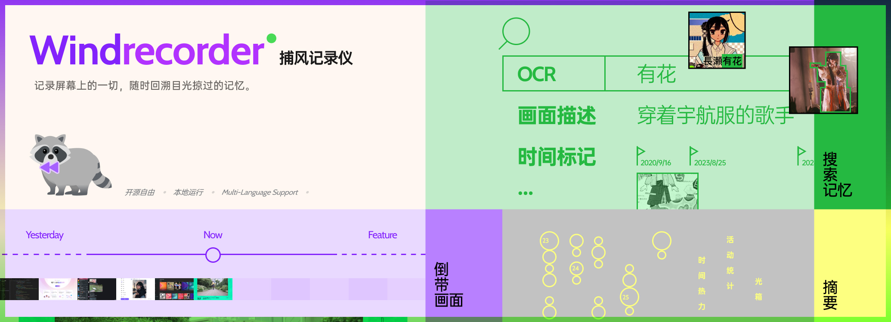

<p align="center">
  
</p>

<h1 align="center">Windrecorder 捕风记录仪 — 个人记忆搜索引擎</h1>

<p align="center">
  以极小的体积持续记录屏幕，读出画面上的文字，之后可以回溯和检索自己看到过的内容。
</p>

<p align="center"><a href="README.md">English</a> | 简体中文</p>

---

Windrecorder 持续录制屏幕，把真正发生变化的画面上识别出的文字与当时的前台窗口标题一起写入索引，然后提供一个检索窗口、一天的回溯视图和活动统计。

录制、索引、检索全部在你自己的机器上、对着同一个文件夹里的文件完成：不需要账号、不需要联网、不上传任何数据。只有两处会向机器外面去，而且两处都要你自己打开：

- **AI**：把你选中的文字发往你在 AI 页填写的接口；
- **MCP**：通过你设定的端口，把这台机器上的历史记录提供给 AI 助手。

本仓库是 [yuka-friends/Windrecorder](https://github.com/yuka-friends/Windrecorder) 的 Windows 分支。抓取、变化判定、月度索引、检索、设置窗口和后台整理这些热路径，都由本仓库 `windcap/` 这个 Rust 工作区编译出的二进制承担，详见 [windcap/README.md](windcap/README.md)。产品里不再包含 Python 运行时，不需要虚拟环境，也不需要管理员权限。


## 能做什么

- 录制单屏、多屏或只录前台窗口，码率和资源占用都很低，可以全天运行并且随时回溯现场画面。
- 只索引内容变化了的画面，把识别文字和窗口标题写进一个月的 SQLite 文件。跳过条件可以按窗口标题、进程名、画面上的文字、以及画面静止多久来设。
- 可以延后的活一律延后：补索引、把截图合成视频、按保留期清理、重画预览图，都安排在你设定的时间窗里做（例如 `03:30` 到 `05:00`）。窗口之外，后台只做抓取本身。
- 既管得住"以后不再被搜到"，也抹得掉"已经被搜到的"。设置页可以给屏幕四边设忽略区域，黑条只画在交给 OCR 的那份副本上，视频一个像素都不少；`windmaint forget` 按你指定的日期或关键词清空已经入库的文字、标题和预览图。
- 提供活动统计、词云、时间轴、光箱、散点图等数据摘要。
- 把屏幕上的内容写成话语：每个录制片段一段，每一天一段，由你自己的接口或者连上来的助手来写。两边写的是同一批文件，放在同样的目录里，是你能直接读、直接改的 JSON。
- 界面内置三种语言：简体中文、English、日本語。
- 任何"读入图片路径、输出识别文字"的程序都可以作为 OCR 引擎驱动；Windows 自带识别、Tesseract 和微信 OCR 都在选择列表里。

## 不做什么

- 图像向量与语义检索是上游的扩展功能，本引擎不做。Rust 一侧会建立并保留它的索引目录，但不从中读任何东西。
- 上游的另一种录制模式——把屏幕直接交给 ffmpeg 录视频——这里也没有实现。本引擎只有一种采集方式：截图阵列；ffmpeg 用在之后，把这些帧合成你观看的视频（`record_mode` 保持 `screenshot_array`）。
- 每行的浏览器地址（`record_deep_linking`）是上游用 UIAutomation 读出来填的。这一列在每个月份库里都存在，在这里恒为空。
- 一台从来没装过 ffmpeg 的机器合不出视频：录制器写的是截图，你看的 `.mp4` 是由截图编码来的，而且不会报错。见下面「安装」。

---

# 第一部分 使用

## 安装

环境要求：Windows 10 或 11 的 x64，以及放得下录像的磁盘。大致量级：录像每月 10–20 GB（取决于屏幕使用时长和显示器数量），SQLite 索引每月约 160 MB。

### 路线一 直接使用发布包（不需要编译器）

1. 从 [Releases](https://github.com/cloneorcopy/Windrecorder-AI-Bridge/releases) 下载 `Windrecorder-native-<版本>.zip` 和同名的 `.sha256` 文件。
2. 核对下载到的字节：

   ```powershell
   Get-FileHash .\Windrecorder-native-0.1.0.zip -Algorithm SHA256
   ```

   结果必须和 `.sha256` 里那串一致。
3. 把它解压到空间充足的空文件夹。解压这一步就是安装：文件夹里现在有 `bin\`、`config_src\`、`ocr_lib\` 和 `__assets__\`。路径没有编进二进制，放哪儿都能跑。
4. 双击 `bin\Windrecorder.exe`。

第一次启动会建立 `userdata\`，用 `config_src\` 里的出厂默认值生成 `userdata\config_user.json`，并在系统托盘放一个图标。不写注册表，不建开始菜单项。

### 路线二 自己从源码编译

1. 安装 [Git](https://git-scm.com/download/win) 和 [rustup](https://rustup.rs)。
2. 在你打算工作的目录里克隆：

   ```powershell
   git clone https://github.com/cloneorcopy/Windrecorder-AI-Bridge.git
   cd Windrecorder-AI-Bridge
   ```

3. 构建并落位：

   ```powershell
   powershell -ExecutionPolicy Bypass -File windcap\build.ps1 -Stage
   ```

   它编译每一个 crate，把可执行文件复制进 `bin\`，最后打出一张表，逐个文件写 PRESENT 或 ABSENT，并说明缺了会失去什么。只要 `windsvc.exe`（托盘）和 `windrec.exe`（录制器）是 PRESENT，装好的东西就能用。双击 `bin\Windrecorder.exe` 启动。

### ffmpeg

合成视频这一步需要 ffmpeg，发布包不带。缺它的时候截图一直堆在 `cache_screenshot\` 里，视频永远合不出来，而且不会有任何错误，因为没有任何一步失败。自己装 ffmpeg——常用的是 [BtbN 的 `ffmpeg-master-latest-win64-gpl-shared.zip`](https://github.com/BtbN/FFmpeg-Builds/releases)，把它的 `bin\` 里的东西放到一个在 `PATH` 上的目录。如果你想给下一台机器一份不用改 `PATH` 的副本，`windcap\extras.ps1` 会用这台机器上已有的 ffmpeg 打出一个 `Windrecorder-ffmpeg-<版本>.zip`，解压到应用文件夹即可。然后确认：

```powershell
bin\windsetup.exe doctor --root .
bin\windmaint.exe convert --root .
```

`doctor` 报告里有一行 `VIDEO STEP`，写明它找到的 ffmpeg 在哪、从哪里找来；`windmaint convert` 会把已经躺在磁盘上的那些帧补上。

## 第一次启动

- **`bin\Windrecorder.exe` 是唯一需要记住的文件。** 它只是一个启动器：拉起 `bin\windsvc.exe`——真正拥有托盘图标、录制锁和录制器的那个进程——并且把它收到的参数原样转交。所以 `Windrecorder.exe doctor` 就是 `windsvc.exe doctor`，打印的报告一字不差。
- 托盘菜单（或双击图标）可以打开窗口、开始或停止录制、退出。关闭窗口后程序继续在托盘里运行；设置里的「关闭窗口时保留托盘运行」可以改掉这个行为。
- 托盘一起来就开始录制，因为出厂的 `start_recording_on_startup` 是开的。留着它，你就不用再按录制按钮。
- `bin\` 里其余的文件不用你手动启动，需要时托盘会起：`windrec` 录制，`winduiweb` 是窗口，`windmcp` 应答 AI 客户端，`windmaint` 做整理，`wind-reindex` 给这台机器装好之前就录下的录像补索引，`windsetup` 铺目录并做旧库迁移，`windnotes`、`windai`、`windcapctl` 是命令行工具。

## 窗口

`winduiweb.exe` 就是界面。六个页签，它们和 `bin\` 里所有其他程序读同一份索引、写同一份设置文件，不需要在两处保持同步：

| 页签 | 在这里做什么 |
|---|---|
| **搜索** | 按关键词和日期范围找画面，并打开录制时的原始分辨率。 |
| **一天之时** | 回溯某一天：当天保留下来的画面，按发生顺序排开。 |
| **摘要** | 一段时间的活动统计、词云、时间轴、光箱和散点图。 |
| **录制** | 录什么、多久录一次、录哪块屏、跳过什么、录像保留多久。 |
| **设置** | 界面语言、本地 OCR 引擎、预览图宽度、OCR 忽略区域、登录时自动启动、整理时间窗。 |
| **AI** | 接口地址、七份提示词、MCP 开关，以及决定哪些内容会被发出去的那些开关。 |

结果旁边的小图只是预览：它按卡片被绘制时的宽度存下来（设置 →「预览图宽度（像素）」，默认 512）。点击任何一张——搜索结果、一天 strip 里的一格、光箱里的一块——窗口都会按录制时的分辨率读取那一帧：截图缓存还在就从缓存取，过了保留期就从视频里取该时刻的一帧；两者都没有的行会直说，而不是把预览放大。

## 挡在外面，和已经进来的再抹掉

这是两件事，产品把它们分开。

**遮罩**决定识别器能看到什么。设置 →「OCR 时忽略屏幕四边的区域范围」，每条边按百分比填。黑条只画在交给 OCR 的那份副本上，视频一个像素都不少；`windrec doctor` 会把遮罩实际盖掉的行列打印出来，你可以核对关心的那条任务栏在不在里面。

**抹除**处理已经入库的东西：

```powershell
bin\windmaint.exe forget --day 2026-09-22 --keyword 收入 --root .
```

它按你指定的时段清空已存的识别文字、窗口标题和预览图。由这些行写出来的 AI 总结一并删除；如果那一天已经无一物可依据，当日总结也一起删——外部模型写的那段话是这里唯一没法重生的东西。`forget` 特意不在任何计划轮次里：要么你运行它，要么不。

删除录像本身归 `windmaint expire`，`forget` 不碰它。

## 后台的活在你指定的时间窗里做

设置页有两个框：「整理遗留工作的开始时间（HH:MM）」和「整理遗留工作的结束时间（HH:MM）」。填上（例如 `03:30` 和 `05:00`，跨午夜就算同一个约定），凡是能从已存数据重算的活都等这个窗口，而不是在你用电脑的时候跑：从保留下来的每一帧里读文字、画预览图、把重复的行折起来、把截图合成视频、按保留期清理、打标签、写总结、做备份。

本来会被 OCR 读的那一帧仍然在抓取当时就生成，作为画面旁边的掩码副本 `<stamp>_cropped.jpg`，因为遮罩只能盖在还活着的像素上。整理时只读这份副本，别的一概不读；找不到掩码副本的行会被报出来、留给下一轮，而不是拿未遮罩的原图顶上。

两个框都留空，就按老规矩：整理等 `idle_maintain_time_gap` 分钟的空闲，录制器照旧边录边识别。

同一页还有「立刻整理」和「停止整理」。停止是真的停止：这一轮在下一个工作项上把手里的活放下，被打断的编码会被丢弃而不是留下半截，下一轮从它放下的地方接着做，而不是重做一遍。

如果你宁愿读一段文字而不是看进度条，整轮整理也可以直接当命令用：

```powershell
bin\windmaint.exe all --root . --dry-run
bin\windmaint.exe text --root .
bin\windmaint.exe doctor --root .
```

九个步骤是 `text`、`convert`、`refresh`、`expire`、`reindex`、`previews`、`ai-tags`、`ai-summaries`、`backup`，合起来叫 `all`。每一轮都把报告写到 `cache\logs\windmaint-idle.log`，所以定时运行删掉了什么，事后读得到。

## AI 总结和标签

话语分两层，由哪一侧来写由你决定。

```powershell
bin\windai.exe summarize --pending
```

把还没有总结的片段发往 AI 页填的接口，并把答案归档。机器空下来时，如果 `enable_ai_summary_in_idle` 是开的，整理轮会对已经定稿的日子做同样的事；`summary_stretch_limit_in_idle` 限定一轮最多接手多少个片段。

所有文字落在 `userdata\result_ai_period_summary\` 和 `userdata\result_ai_daily_summary\`，按本产品自己的日子（凌晨 3 点起算）一天一个 JSON 文件，摊在明面上：不进数据库，也没有黑盒。七份提示词都是 AI 页上可以直接改的纯文本。任何地方都没有长度上限，也不会有人拿词表去筛写回来的话。

当天的总结在每一个片段都有总结之前会被直接拒绝写入；你送 `allow_partial` 它就写，并同时记下 `partial: true`，之后每一次读取都照实说这一天是残缺的。

想知道自己的安装究竟会发什么出去：`bin\windai.exe doctor` 打印接口、模型和密钥指纹，并且只发一次往返请求。

## 让 AI 助手读这台机器的记录（MCP）

在 AI 页勾选「通过 MCP 向 AI 工具开放本机记录」。托盘随后把 `windmcp.exe` 起成一个常驻的 HTTP 服务，这台机器上的所有助手共用它，谁也不用自己拉一份。客户端指向

```
http://<host>:<port>/mcp        Authorization: Bearer <token>
```

地址、端口和令牌分别是 `mcp_server_host`、`mcp_server_port`、`mcp_server_token`。关掉鉴权又绑到非回环地址时，`windmcp` 拒绝启动；把开关关掉，桥就停。

一共十一个工具：九个只读（状态、检索、某个时刻附近、各程序使用时长、一天的总结、单帧、待总结队列、已有总结、提示词原文），两个写。两个写工具只往上面那两个总结目录里放文字，绝不写索引，也绝不碰录像。`windrecorder_summaries_pending` 说明哪些片段还缺，并把每个片段的**完整**识别文字一并带上，所以"读"这一步只需要一次调用。

没有配置任何客户端时，同样的问题可以在终端里问：

```powershell
bin\windmcp.exe summaries-pending --day 2026-09-26
bin\windmcp.exe summaries-read --json
bin\windmcp.exe period-summary-write <segment> --text-file notes.md
bin\windmcp.exe day-summary-write 2026-09-26
bin\windmcp.exe doctor
```

`--json` 给出助手看到的原样字节。

## 选择 OCR 引擎

设置 →「本地 OCR 引擎」。录制时实时索引用它，`wind-reindex` 重读旧录像时也用它。本产品能驱动的是任何"读入图片路径、向标准输出写文字"的程序：

| 引擎 | 怎么接 |
|---|---|
| Windows 自带识别（`Windows.Media.Ocr`） | 默认引擎，随 `ocr_lib\` 提供；系统里要装对应语言包 |
| [Tesseract](https://github.com/tesseract-ocr/tessdoc) | 装好后设置 `TesseractOCR_filepath`；支持 100 多种语言，可同时识别 |
| 任何同样契约的程序 | 把 `ocr_engine_command` 设成它的参数列表，一个参数一项 |
| [微信 OCR](https://github.com/kanadeblisst00/wechat_ocr) | 原生可驱动，走当初那个 Python 包用的同一条 mmmojo 通道，是一个常驻子进程 |

微信 OCR 的二进制是第三方从微信组件里提取的，不在本仓库、也不在应用发布包里；那个组件自己声明仅供学习和个人使用，不适合商用。把三样东西放到 `ocr_lib\wxocr-binary\` 下：

```
ocr_lib\wxocr-binary\WeChatOCR.exe
ocr_lib\wxocr-binary\mmmojo_64.dll
ocr_lib\wxocr-binary\Model\
```

放齐之后，选择列表里就出现 `WeChatOCR` 这一行。`bin\windsetup.exe check-engines` 会用随包提供的测试图给每个引擎打分，并且在三样东西没放齐时点名缺的是哪个文件。

Rapid OCR 与 ChineseOCR-lite 在选择列表里被标为"无法运行"而不提供：它们的识别过去跑在本产品已经不再包含的 Python 里。以同样契约提供 `.exe` 的程序可以用 `ocr_engine_command` 驱动。

## 界面语言与开机自启

设置 →「🌎 界面语言」，可选简体中文、English、日本語。可选项只列出 `config_src/languages.json` 真正翻译过的语言，每种语言以自己的文字显示名称。托盘菜单、窗口和 AI 的回答都跟着它走。

设置 →「登录时自动启动」把托盘登记到你的 Windows 账户，等价于：

```powershell
bin\windsetup.exe autostart --enable
```

它写的是当前用户的 `HKCU\Software\Microsoft\Windows\CurrentVersion\Run`，指向 `bin\windsvc.exe`：是托盘，不是窗口，也不是启动器，因为登录项必须写那个持有锁的进程。不需要管理员权限。

## 数据放在哪里

全部都在应用文件夹里，搬家就是把文件夹搬走：

| 路径 | 内容 |
|---|---|
| `userdata\videos\` | 录像 |
| `userdata\db\` | 一个月一个 SQLite 文件，外加读取用的、可以随手删掉的 `_TEMP_READ.db` 副本 |
| `userdata\result_*\` | 词云、时间轴、光箱、标签，以及两类 AI 总结 |
| `userdata\config_user.json` | 你的设置，由 `config_src\config_default.json` 播种 |
| `cache_screenshot\` | 等着被合成视频的截图 |
| `cache\logs\` | 每轮后台整理做了什么，包括删掉了什么 |

## 常见问题

**好像什么都不工作。** 问这台机器上装的到底是什么、按录制会跑哪条命令：

```powershell
bin\Windrecorder.exe doctor --root .
```

它打印每个二进制的构建种类和路径、每个托盘项会运行的命令行、锁表（free / LIVE pid / stale），并点名缺的是哪个文件。缺 `windrec.exe` 就是缺文件，不会悄悄回退到别的东西。

**打开窗口时最近一段没有数据。** 读取端从不查还在写的索引文件，它查每个月份库旁边的 `_TEMP_READ.db` 副本，原件比副本新五分钟以上时副本会重建。这些副本随时删掉都安全——下一次读取自然重建。`bin\windrec.exe status --root .` 和 `bin\windmaint.exe doctor --root .` 报的是索引里实际有多少东西，于是你能分清"那天真的没录"和"副本没读出来"。

**报一个读不了的 `_TEMP_READ.db` 或 `-journal` 文件。** 通常是后台还在索引时第一次打开窗口，副本正写到一半。等索引跑完，删掉 `db` 目录里对应的 `*_TEMP_READ.db`，刷新即可。

**Windows 自带识别没结果或识别率很低。** 先确认系统里装了目标语言的语言包或输入法，再考虑第三方引擎——它们一般更准，也能同时识别多种语言，代价是资源占用和识别时间。

**整理时间窗一直没跑。** `bin\windmaint.exe all --root . --dry-run` 不取锁、不写任何东西，只把调度判断打印出来——比如窗口已经关掉，或者还没有被要求跑空闲轮。

---

# 第二部分 二次开发

## 目录里有什么

| 路径 | 是什么 |
|---|---|
| `windcap\` | Rust 工作区，产品运行的每个二进制都在这里。crate 分工见 [windcap/README.md](windcap/README.md)。 |
| `windcap\winduiweb\` | 实际发布的窗口：`src\` 是 React 与 TypeScript 前端，`src-tauri\` 是 Tauri 外壳。 |
| `bin\` | **落位好的发布二进制，不进版本管理。** 由 `build.ps1 -Stage` 写入；在开发机上它同时是一个正在使用的安装。 |
| `config_src\` | 出厂默认设置、提示词、语言目录、同义词索引。应用从这里播种 `userdata\config_user.json`。 |
| `ocr_lib\` | Windows OCR 的命令行，也是 `wxocr-binary\` 该放的位置。 |
| `__assets__\` | 给 OCR 引擎打分用的测试图，以及文档配图。 |
| `docs\adr\` | 架构决策记录。要改边界，先读这几篇。 |

## 构建

```powershell
powershell -ExecutionPolicy Bypass -File windcap\build.ps1 -Stage
```

`build.ps1` 一个 crate 一次 cargo 调用，任何一个编不过都不会拖走其他的；然后逐个产物打 PRESENT/ABSENT。rustc 自己的输出进 `windcap\target\build.log`，只有失败的 crate 才把尾部贴回屏幕。

| 参数 | 作用 |
|---|---|
| `-Profile release\|debug` | cargo 的 profile，也是取产物的目录。默认 `release`。 |
| `-SkipUi` | 两个前端都不编。只能用来预演——产物里就没有窗口了。 |
| `-Stage` | 把编好的可执行文件复制进 `bin\`。 |
| `-Manifest PATH` | 把逐产物的结果写成制表符分隔的行，`release.ps1` 读它。 |

其他参数一律报错，不会当成空操作放过。退出码 `0` 表示要编的都编好了，`1` 表示有东西缺失，`2` 是命令行写错。注意：机器上完全没有任何 Rust 工具链时也是 `0`，此时汇总表会点名每一个你没有的文件。

## 不安装，直接跑源码树

运行时按固定顺序找二进制，先命中者生效：

| 顺序 | 目录 |
|---|---|
| 1 | `%WINDCAP_HOME%` |
| 2 | `<root>\bin\` |
| 3 | `<root>\` |
| 4 | `<root>\windcap\target\release\` |
| 5 | `<root>\windcap\target\debug\` |

所以只 `cargo build --release` 也够跑产品：把托盘指向仓库根目录，根目录因为带着 `config_src\`，就被认成一个安装。

```powershell
cargo build --release --manifest-path windcap\Cargo.toml
windcap\target\release\windsvc.exe run --root .
```

release 永远赢过 debug，而任何报告打印到 debug 二进制时都会标出 `debug` 这个词。想在不动现有安装的前提下测另一棵树的产物，用 `%WINDCAP_HOME%`。

## cargo 的三件事，每件都要一个回合才知道

1. **根目录没有 manifest。** `Cargo.toml` 在 `windcap\`，所以从仓库根跑任何 cargo 命令都要 `--manifest-path windcap\Cargo.toml`（或者先 `cd windcap`）。
2. **包名不等于可执行文件名。** `-p windai` 匹配不到任何东西，包名是 `wind-ai`。十六个包分别是 `windcap-core`、`wind-base`、`wind-store`、`wind-summary`、`windcap-cli`、`windrec`、`wind-maint`、`wind-reindex`、`windsvc`、`wind-setup`、`wind-ai`、`wind-mcp`、`wind-notes`、`windui`、`windui-web`、`wind-launcher`。写错一个名字，命令在任何编译发生之前就中止。
3. **不要在这里跑 `cargo fmt`。** 全树是手工排版的长行，也没有 `rustfmt.toml`，工具默认值会改写两百多处与本次改动无关的片段。按周围的风格手写对齐。

## 测试

```powershell
cargo test --workspace --no-fail-fast --manifest-path windcap\Cargo.toml
```

`--no-fail-fast` 必须加：不加时 cargo 停在第一个 crate，后面十几个根本没跑，"套件失败"这句话就什么也说明不了。

这个检出通常同时是某个人正在用的安装，而有一批测试会读安装状态（`userdata\config_user.json`、活的录制锁、`bin\` 里的内容）。在一台正在录制、并且桥也开着的机器上，`wind-base`、`wind-ai`、`wind-maint`、`windui`、`windsvc` 里各有一项红是预期的，每条红报的都是只存在于 `userdata\` 里的值。这不是回归，也绝不要靠改别人的配置文件把它变绿。要干净地给一次改动把关，就在 git worktree 里跑：没有 `userdata\`、没有活锁的那棵树是全绿的。

另一处只在新检出会出现的坑：`core.autocrlf` 开着而仓库里没有 `.gitattributes`，于是 `config_src\ai_prompts\*.txt` 被写成 CRLF，而有几条测试拿这些文件和 LF 字面量逐字节比对。把工作副本里的 `\r` 去掉即可；库里的 blob 仍是 LF。

## 窗口（winduiweb）

前端资源在编译时被嵌进可执行文件，所以改前端要动两半：

```powershell
cd windcap\winduiweb
pnpm install          # 仓库里提交的锁文件是 pnpm-lock.yaml
pnpm build
cargo build --release -p windui-web --features windui-web/custom-protocol
```

`--features windui-web/custom-protocol` 不是可选项。少了它，二进制会去打开 `build.devUrl`（`http://localhost:1421`），渲染出一个"连接被拒绝"的页面——看着像安装坏了，其实不是。快速来回用 `pnpm typecheck`；`node_modules\`、`dist\` 和 `src-tauri\gen\` 全都在 gitignore 里。

## 打包，然后证明它

```powershell
powershell -ExecutionPolicy Bypass -File windcap\release.ps1
powershell -ExecutionPolicy Bypass -File windcap\smoke.ps1
```

`release.ps1` 调 `build.ps1 -Profile release`，在 `windcap\dist\` 下摆一棵 staging 树，写出 `Windrecorder-native-<版本>.zip` 和它的 `.sha256`。版本号从 `windcap\Cargo.toml` 的 `[workspace.package]` 里解析出来，不是抄一份。只有在**这一轮**报 BUILT 的产物才会被装进包里；缺 `windrec.exe` 或 `windcap.dll` 就没有包，而不是拿一份旧字节盖上新日期。`windcap\dist\` 和 `windcap\target\` 都在 gitignore 里。

`smoke.ps1` 把守的是 zip，不是 `bin\`。它把包解到 `%TEMP%`，给这个一次性安装补上发布包不该带的那样东西（一个 `userdata\`，里面放一份冻结的月份库），然后用包里的二进制对着那个根目录跑，并且**断言输出而不是退出码**——这些程序报告"什么都没找到"时同样是退出 0，而布局错误恰好就是这个形状。它核对哈希、归档根位置、`bin\` 里每个成员是否在场、DLL 的候选顺序、DLL 与源码声明的 ABI 版本是否一致、对已知参考行的检索与统计、托盘和启动器空参数启动时是否真的铺好目录并取到锁、以及只读命令有没有创建或改动任何东西。做不了的检查打 SKIP，不算通过，也不允许这一轮声称"能跑"。把 `-Zip` 指向一份故意改坏的副本，是了解这道门禁究竟是门禁还是样子货的唯一办法。机器上的录制还在进行时，`-Source` 要给一份冻结的月份库副本，因为有三项参考检查会数它的行数。

`windcap\extras.ps1` 打那两个第三方包——`Windrecorder-ffmpeg-<版本>.zip` 和 `Windrecorder-wxocr-binary-<版本>.zip`，各自带哈希——因为这两份许可不是本项目能折进一个 GPL-2.0 应用包里的东西。它先打包机器上已有的文件，再把每个包重新解开跑一遍：微信那个必须给三张测试图打分，ffmpeg 那个必须被 `doctor` 认出来自*这一份*安装。做不到就报错退出，而不是悄悄发出去。

## 需要延续的约定

- **一个月份库同一时刻只有一个写者。** 步骤次序保证不会有两个步骤同时打开同一个文件；`busy_timeout` 是给读者的兜底，不是拿来当写锁用的。
- **一轮不许许诺它达不到的数。** 进度条的分母是这一轮真正接手的工作件数，被排除在外的要写出来，不能留成一段没人解释的空档。
- **不可重算的东西要比可重算的东西更小心。** 这就是遮罩必须在抓取时生效、`forget` 要连带删掉派生的 AI 文字、`backup` 要把两个总结目录一起抄走、`forget` 不在任何定时轮次里的原因。
- **每一个命令行选项都要写进帮助文本**，并且有测试检查这一条。加了选项不写帮助，守护就红。
- **`windcap/core` 保持零第三方依赖。** 每个 Win32 调用都是手写的 `extern "system"` 声明，所以一台只有 cargo 缓存的机器也能 `cargo build --offline`。不要往那里加 Win32 crate。
- **停录制要走控制台中断。** 体面的停法是给录制器发 `CTRL_BREAK_EVENT`，它会关掉并提交当前这一段；`taskkill` 跳过这一切，最多丢掉整段时长。

## 参与

界面翻译改 `config_src\languages.json`（以及窗口的文案目录），说明见 [`__assets__/Multilingual_Translation_Contribution_Guide.md`](__assets__/Multilingual_Translation_Contribution_Guide.md)。接入一个 OCR 引擎只需要满足"图片进、文字出"这个契约，写在 [`windcap/base/src/ocr.rs`](windcap/base/src/ocr.rs)，`bin\windsetup.exe check-engines` 会拿这些测试图给每个已登记的引擎打分。提出改动某个边界之前先读 `docs\adr\`：哪个界面是唯一的界面、AI 地址能被要求做什么、整理一轮允许同时跑几件事。

## 许可与出处

Windrecorder 以 **GPL-2.0** 授权，见 [LICENSE](LICENSE)。

本仓库是 [yuka-friends/Windrecorder](https://github.com/yuka-friends/Windrecorder) 的分支。产品、界面设计与索引 schema 都来自 Windrecorder 项目；`windcap\` 里的 Rust 引擎重写了两条热路径，承载它们的 Python 应用已从本树中移除。

第三方组件不打包进应用发布包，并且各自保留自己的条款：[Tesseract](https://github.com/tesseract-ocr/tessdoc)、[Windows.Media.Ocr.Cli](https://github.com/zh-h/Windows.Media.Ocr.Cli)、[wechat_ocr](https://github.com/kanadeblisst00/wechat_ocr)（其中微信组件声明仅供学习与个人使用）、[RapidOCR](https://github.com/RapidAI/RapidOCR)、[chineseocr_lite](https://github.com/DayBreak-u/chineseocr_lite)、[ffmpeg](https://ffmpeg.org/) 与 [uForm](https://github.com/unum-cloud/uform)。
